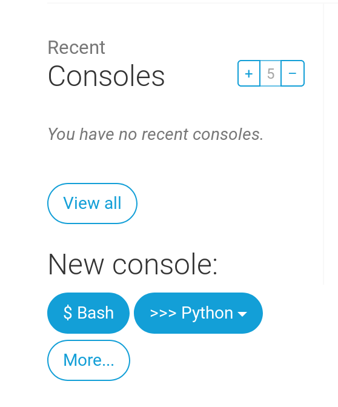

# Optional: Veröffentlichen!

## Veröffentlichen!

> **Hinweis:** Durch das folgende Kapitel muss man sich manchmal durchbeißen. Es ist daher optional. Wenn du deine Seite im Web veröffentlichen möchtest, bleib dran und gib nicht auf; die Website zu veröffentlichen, ist ein sehr wichtiger Schritt. Dieses Kapitel ist in der Mitte des Tutorials platziert, damit dir dein Mentor mit dem etwas anspruchsvolleren Vorgang der Veröffentlichung deiner Website helfen kann. Den Rest des Tutorials kannst du dann auch alleine beenden, sollte die Zeit nicht ausreichen.

Bis jetzt war deine Webseite nur auf deinem Computer verfügbar. Jetzt wirst du lernen wie du sie 'deployst'! Deployen bedeutet, dass du deine Anwendung im Internet veröffentlichst, so dass endlich jeder darauf zugreifen kann. :\)

Wie du schon gelernt hast, muss eine Webseite auf einem Server liegen. Es gibt eine Vielzahl von Hosting \(Server\)-Anbietern im Internet, wir werden [PythonAnywhere](https://www.pythonanywhere.com/) verwenden. PythonAnywhere ist kostenlos für kleine Anwendungen, die nicht von vielen Besuchern aufgerufen werden. Also erstmal genau das Richtige für dich.

Nun sind drei Orte werden für dich wichtig. Die Entwicklung und das Testen erfolgt weiter auf deinem lokalen Rechner. Wenn du mit deinen Änderungen zufrieden bist, wirst du eine Kopie deines Programms auf GitHub veröffentlichen. Schließlich wird deine Website auf PythonAnywhere gehostet. Ändern kannst du sie, indem du eine neue Version deines Codes von GitHub herunter lädst.

## Deinen Blog auf PythonAnywhere einrichten

### Registriere dich für ein PythonAnywhere Konto

> **Hinweis:** Es ist möglich, dass du bereits ein PythonAnywhere Konto angelegt hast. Wenn ja, dann brauchst du das nicht noch einmal zu tun.

PythonAnywhere ist ein Dienst, mittels dem Python auf Servern "in der Cloud" ausgeführt werden kann. Wir werden ihn verwenden, um unsere Seite zu hosten, live und im Internet.

Wir werden den Blog, den wir bauen, auf PythonAnywhere hosten. Registriere dich auf PythonAnywhere für ein "Beginner"-Konto \(die kostenfreie Stufe ist ausreichend, du brauchst keine Kreditkarte\).

* [www.pythonanywhere.com](https://www.pythonanywhere.com/)

[](https://github.com/hannesrothe/tutorial/blob/master/de/deploy/images/pythonanywhere_beginner_account_button.png)

> **Hinweis** Beachte bei der Wahl deines PythonAnywhere-Benutzernamens, dass die URL deines Blogs die Form `deinbenutzername.pythonanywhere.com` haben wird. Wähle also einen Namen, unter dem du veröffentlichen willst, oder einen Namen, der den Inhalt deines Blogs beschreibt. Und vergiss dein Passwort nicht \(füge es deinem Passwortmanager hinzu, wenn du einen benutzt\).

### Erstellen eines PythonAnywhere API-Tokens

Das Folgende musst du nur einmal machen. Wenn du dich auf PythonAnywhere angemeldet hast, kommst du aufs "Dashboard". Oben rechts findest du den Link zu deiner "Account"-Seite:

[](https://github.com/hannesrothe/tutorial/blob/master/de/deploy/images/pythonanywhere_account.png)

Klicke dort auf den Reiter namens "API token" und dann auf den Knopf, der mit "Create new API token" beschriftet ist.

[](https://github.com/hannesrothe/tutorial/blob/master/de/deploy/images/pythonanywhere_create_api_token.png)

### Unsere Site auf PythonAnywhere konfigurieren

Gehe zurück zum [Haupt-Dashboard PythonAnywhere](https://www.pythonanywhere.com/), indem du auf das Logo klickst. Dann wähle die Option zum Start einer "Bash"-Konsole – die PythonAnywhere Version einer Kommandozeile wie du sie auf deinen Computer hast.



> **Hinweis:** PythonAnywhere basiert auf Linux. Wenn du Windows benutzt, dann sieht die Konsole etwas anders aus als die Konsole auf deinem Computer.

Um eine Web App auf PythonAnywhere publizieren zu können, muss dein Code von GitHub heruntergeladen und PythonAnyhwere dazu gebracht werden, diesen zu erkennen und als Web Applikation anzubieten. Du kannst das auch manuell machen. Aber PythonAnywhere stellt ein Hilfstool zur Verfügung, das das alles für dich erledigt. Lass es uns installieren:

```text
$ pip3.6 install --user pythonanywhere
```

Nach diesem Befehl solltest du in etwa Folgendes sehen: `Collecting pythonanywhere`, und irgendwann den Schluss `Successfully installed (...) pythonanywhere- (...)`.

Nun können wir mit dem Hilfstool unsere App von GitHub automatisch konfigurieren. Gib das Folgende in der Konsole auf PythonAnywhere ein \(vergiss nicht, deinen GitHub-Benutzernamen an Stelle von `<your-github-username>` zu benutzen, so dass die URL der clone-URL von GitHub entspricht\):

```text
$ pa_autoconfigure_django.py https://github.com/<your-github-username>/my-first-blog.git
```

Während du die Ausführung verfolgst, wirst du sehen, was passiert:

* Den Code von GitHub herunterladen
* Eine virtuelle Umgebung auf PythonAnywhere einrichten, genau wie die auf deinem eigenen Computer
* Deine Einstellungen mit ein paar Veröffentlichungseinstellungen aktualisieren
* Eine Datenbank auf PythonAnywhere einrichten mit dem Befehl `manage.py migrate`
* Deine statischen Dateien einrichten \(darüber lernen wir später etwas\)
* PythonAnywhere so einrichten, dass es deine Web-App über seine Schnittstelle \(API\) präsentieren kann

Diese Schritte wurden auf PythonAnywhere automatisiert, aber es sind die selben Schritte, die du bei jedem anderen Server-Provider machen müsstest.

Das Wichtigste im Moment ist, dass du weißt, dass Deine Datenbank auf PythonAnywhere vollständig unabhängig von deiner Datenbank auf deinem eigenen PC ist, so dass sie unterschiedliche Posts und Administratorenkonten haben kann. Aus diesem Grund müssen wir das Administratorenkonto mittels `createsuperuser` initialisieren - wie wir das auf deinem eigenen Computer getan haben. PythonAnywhere hat deine virtualenv automatisch für dich aktiviert. Du musst nur noch Folgendes ausführen:

```text
(ola.pythonanywhere.com) $ python manage.py createsuperuser
```

Trage die Informationen für deinen Administrator ein. Am Besten verwendest du die selben Daten wie auf deinem eigenen Computer, um Verwechslungen zu vermeiden - es sei denn, du willst das Passwort auf PythonAnywhere sicherer machen.

Nun kannst auch einen Blick auf deinen Code auf PythonAnywhere werfen mittels `ls`:

```text
(ola.pythonanywhere.com) $ ls
blog  db.sqlite3  manage.py  mysite requirements.txt static
(ola.pythonanywhere.com) $ ls blog/
__init__.py  __pycache__  admin.py  apps.py  migrations  models.py
tests.py  views.py
```

Du kannst auch auf die "Files"-Seite gehen und mit PythonAnywheres eingebautem Datei-Manager navigieren. \(Von der "Console"-Seite gelangst du über das Menü in der rechten oberen Ecke zu anderen PythonAnywhere-Seiten. Sobald du auf einer dieser Seiten bist, findest du die Links zu den anderen Seiten oben über dem Seiteninhalt.\)

### Du bist jetzt live!

Nun ist deine Site also live im öffentlichen Internet! Klick dich zur PythonAnywhere "Web"-Seite durch und hole dir den Link. Teile ihn, so oft du willst :\)

> **Hinweis:** Da es sich hier um ein Anfänger-Tutorial handelt, haben wir ein paar Abkürzungen genommen, um die Site zu veröffentlichen, welche sicherheitstechnisch nicht ideal sind. Fall du dich entscheidest, dieses Projekt weiterzubauen oder ein neues Projekt anzufangen, dann solltest du die [Django deployment checklist](https://docs.djangoproject.com/en/2.0/howto/deployment/checklist/) durchgehen, um einige Tipps zur Absicherung deiner Seite zu erhalten.

### Debugging Tipps

Solltest du beim Ausführen des `pa_autoconfigure_django.py` Skripts eine Fehlermeldung erhalten, findest du folgend ein paar bekannte Gründe hierfür:

* Du hast vergessen deinen PythonAnywhere API-Token zu erstellen.
* Du hast in deiner GitHub-URL einen Fehler gemacht.
* Falls du die Fehlermeldung _"Could not find your settings.py"_ erhältst, liegt das wahrscheinlich daran, dass du nicht alle Files zum Git hinzugefügt und/oder diese nicht erfolgreich auf GitHub veröffentlicht hast. Schau dir nochmals den Git-Abschnitt weiter oben an.

Falls du eine Fehlermeldung erhältst, wenn du versuchst, deine Site aufzurufen, solltest du als Erstes die Debugging-Informationen im **error log** anschauen. Den Link dazu findest du über [die PythonAnywhere-Seite "Web"](https://www.pythonanywhere.com/web_app_setup/). Schau nach, ob darin Fehlermeldungen enthalten sind; die neuesten findest du ganz unten.

Du findest einige [Allgemeine Debugging Tipps im PythonAnywhere Wiki](http://help.pythonanywhere.com/pages/DebuggingImportError).

Und denke daran, dein Coach ist da, um zu helfen!

## Schau dir deine erste Website an!

Auf der Defaultseite deiner Site sollte "It worked!" stehen - genau so wie auf deinem lokalen Computer. Füge nun `/admin/` ans Ende deiner URL an und du kommst auf die Admin-Site. Logge dich mit Benutzername und Passwort ein, und du wirst sehen, dass du auf dem Server neue Posts hinzufügen kannst -- die Posts aus deiner lokalen Test-Datenbank wurden ja nicht auf deinen öffentlichen Blog geschickt.

Wenn du ein paar Posts erstellt hast, kannst du zurück auf dein lokales Setup \(nicht PythonAnywhere\) wechseln. Ab jetzt solltest du für Änderungen auf deinem lokalen Setup arbeiten. So wird in der Web-Entwicklung gearbeitet - Änderungen lokal machen und diese dann auf GitHub veröffentlichen und dann deine Änderungen auf den produktiven Webserver ziehen. So kannst du Sachen ausprobieren, ohne deine produktive Website kaputt zu machen. Ziemlich cool, oder?

Klopf dir _kräftig_ auf die Schulter! Server-Deployment ist eines der kompliziertesten Dinge der Web-Entwicklung und es dauert oftmals mehrere Tage, bis alles läuft. Aber du hast deine Site jetzt live, im echten Internet!

## Jetzt zum Deployment deiner Django Website.

Es wäre gut, deine Django Website live draußen im Internet zu sehen, oder? Lass uns noch eine PythonAnywhere-Anwendung erstellen:

### Committe und pushe deinen Code auf GitHub

Lass uns nachsehen, welche Dateien sich nach dem letzten Veröffentlichen \(Deployment\) geändert haben. \(Führe diese Befehle lokal aus und nicht auf PythonAnywhere\):

```text
$ git status
```

Stelle sicher, dass du im `Djangogirls` Verzeichnis bist und sag `git`, dass alle Änderungen in diesem Verzeichnis hinzugefügt werden sollen:

```text
$ git add --all .
```

> **Beachte:** `--all` bedeutet, dass `git` auch Dateien berücksichtigt, die du gelöscht hast \(in der Standardeinstellung werden nur neue/geänderte Dateien hinzugefügt\). Denk auch daran \(Kapitel 3\), dass `.` das aktuelle Verzeichnis meint.

Bevor wir alle Dateien hochladen, prüfen wir noch einmal, was `git` hochladen will \(alle Dateien, die `git` hochladen wird, sind jetzt grün\):

```text
$ git status
```

Fast fertig, wir sagen nun noch, dass diese Änderung in der Verlaufsübersicht gespeichert werden soll. Wir erstellen eine "Commit Message", die beschreibt, was wir verändert haben. Du kannst an diesem Punkt hier alles reinschreiben, aber es ist sehr nützlich, etwas zu Sinnvolles einzutragen, damit du dich in Zukunft erinnern kannst, was du geändert hast.

```text
$ git commit -m "HTML der Site geändert."
```

> **Beachte:** Du musst Anführungszeichen um den Commit-Kommentar setzen.

Nachdem wir das gemacht haben, laden \(push\) wir unsere Änderungen auf GitHub:

```text
$ git push
```

### Hol dir den neuen Code auf PythonAnywhere und aktualisiere deinen Browser

* Öffne die [PythonAnywhere consoles page](https://www.pythonanywhere.com/consoles/) und gehe zu deiner **Bash-Konsole** \(oder starte eine neue\). Dann, führe Folgendes aus:

```text
$ cd ~/<deine-pythonanywhere-domain>.pythonanywhere.com
$ git pull
[...]
```

Du musst `<deine-pythonanywhere-domain>` durch deine tatsächliche PythonAnywhere-Subdomain zu ersetzen - ohne die spitzen Klammern. Normalerweise ist deine Subdomain dein PythonAnywhere-Benutzername, aber in manchen Fällen ist sie leicht anders \(z.B. wenn dein Benutzername Großbuchstaben enthält\). Wenn dieser Befehl also nicht funktioniert, verwende den Befehl `ls` \(listet Dateien auf\), um den tatsächlichen Subdomain-/Ordner-Name herauszufinden, und verwende dann `cd`, um dorthin zu wechseln.

Nun sieh zu, wie dein Code heruntergeladen wird. Wenn du überprüfen willst, dass er angekommen ist, geh' hinüber zur **Seite "Files"** and schau deinen Code auf PythonAnywhere an \(du kannst andere PythonAnywhere-Seiten über den Menü-Knopf auf der Konsolen-Seite erreichen\).

* Spring anschließend rüber zur [Seite "Web"](https://www.pythonanywhere.com/web_app_setup/) und klick auf **Neu laden** in deinem Browser.

Dein Update sollte live sein! Lade die Seite neu in deinem Browser. Es sollten nun Änderungen zu sehen sein. :\)

### Die statischen Dateien auf dem Server aktualisieren

Server wie PythonAnywhere behandeln statische Dateien \("static files", z.B. CSS-Dateien\) anders als Python-Dateien, weil statische Dateien noch optimiert und dadurch dann schneller geladen werden können. Deswegen müssen wir, nachdem wir Änderungen an den CSS Dateien vorgenommen haben, einen zusätzlichen Befehl auf dem Server ausführen, um diese Dateien zu aktualisieren. Der Befehl heißt `collectstatic`.

Aktiviere also deine virtuelle Umgebung, wenn sie nicht vom letzten Mal noch aktiv ist \(PythonAnywhere benutzt dazu das Kommando `workon`, das ist ähnlich wie `source myenv/bin/activate`, das du auf deinem Computer verwendest\):

```text
$ workon <deine-pythonanywhere-domain>.pythonanywhere.com
(ola.pythonanywhere.com)$ python manage.py collectstatic
[...]
```

Der `manage.py collectstatic` Befehl ist ein bisschen wie `manage.py migrate`. Wir machen ein paar Änderungen in unserem Code und dann sagen wir Django, dass es diese übernehmen \(_apply_\) soll, entweder zu der servereigenen Sammlung von statischen Dateien oder in die Datenbank.

Auf jeden Fall sind wir nun soweit, dass wir [auf die Seite "Web"](https://www.pythonanywhere.com/web_app_setup/) wechseln können \(mittels dem Menü-Knopf in der Ecke oben rechts\) und **Reload** klicken können. Schau dir dann die Seite [https://subdomain.pythonanywhere.com](https://subdomain.pythonanywhere.com) an, um das Ergebnis zu sehen.

Und das sollte es sein! Herzlichen Glückwunsch :\)

