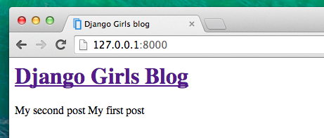
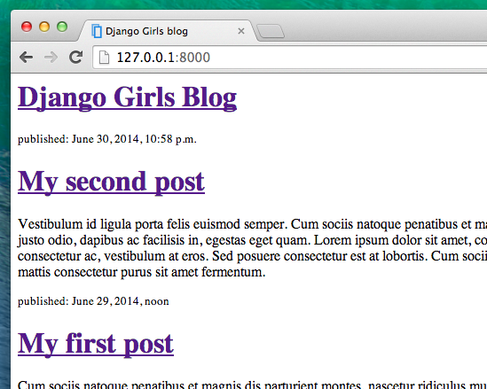

# W7 Django-Templates

Es wird Zeit, ein paar Daten anzuzeigen! Django bringt dafür bereits ein paar sehr hilfreiche **Template-Tags** mit.

## Was sind Template-Tags?

Also, in HTML kann man nicht wirklich Python-Code schreiben, weil es der Browser nicht verstehen würde. Denn der kennt nur HTML. Wir wissen, dass HTML ziemlich statisch ist, während Python dynamischer ist.

Die **Django-Template-Tags** erlauben uns, Python-artige Dinge ins HTML zu bringen, so dass man einfach und schnell dynamische Websites erstellen kann. Super!

## Anzeigen des Post-List-Templates

Im vorangegangen Kapitel haben wir unserem Template in der `posts`-Variable eine Liste von Posts übergeben. Diese wollen wir jetzt in HTML anzeigen.

Um eine Variable in einem Django-Template darzustellen, nutzen wir doppelte, geschweifte Klammern mit dem Namen der Variable darin, so wie hier:


```markup
{{ posts }}
```


Versuche das in deinem `blog/templates/blog/post_list.html` Template. Öffne es in deinem Code-Editor und ersetze alles vom zweiten `<div>` bis zum dritten `</div>` mit `{{ posts }}`. Speichere die Datei und aktualisiere die Seite, um die Ergebnisse anzuzeigen.


Wie du siehst, haben wir nun das:

```markup
<QuerySet [<Post: My second post>, <Post: My first post>]>
```

Das heißt, Django versteht es als Liste von Objekten. Kannst du dich noch an die Einführung von Python erinnern, wie man Listen anzeigen kann? Ja, mit for-Schleifen! In einem Django-Template benutzt du sie so:


```markup

    {{ post }}

```


Versuch das in deinem Template.



Es funktioniert! Aber wir wollen, dass die Posts so wie die statischen Posts angezeigt werden, die wir vorhin im **Einführung in HTML**-Kapitel erstellt haben. Du kannst HTML und Template Tags mischen. Unser `body` sollte dann so aussehen:


```markup
<div>
    <h1><a href="/">Django Girls Blog</a></h1>
</div>


    <div>
        <p>published: {{ post.published_date }}</p>
        <h2><a href="">{{ post.title }}</a></h2>
        <p>{{ post.text|linebreaksbr }}</p>
    </div>

```




Ist dir aufgefallen, dass wir diesmal eine etwas andere Notation benutzen haben \(`{{ post.title }}` oder `{{ post.text }}`\)? Wir greifen auf Daten von jedem Feld unseres `Post`-Models zu. Außerdem leitet das `|linebreaksbr` den Text der Posts durch einen Filter, um Zeilenumbrüche in Absätze umzuwandeln.

Funktioniert super? Wir sind so stolz auf dich! Steh kurz auf und geh ein Stück weg vom Computer. Du hast dir eine Pause verdient :\)


