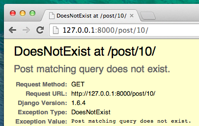
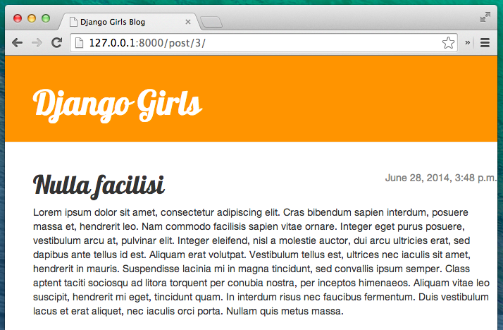

# W9 Erweitere deine Anwendung

## Erweitere deine Anwendung

Wir haben bereits die verschiedenen Schritte für die Erstellung unserer Website abgeschlossen: Wir wissen, wie man Models, URLs, Views und Templates schreibt. Wir wissen auch, wie wir unsere Website verschönern.

Zeit zu üben!

Das erste, was unser Blog braucht, ist eine Seite, auf der ein einzelner Blogpost dargestellt wird, oder?

Wir haben bereits ein `Post`-Model, deshalb brauchen wir nichts zur `models.py` hinzufügen.

### Erstelle eine Template-Verknüpfung

Wir beginnen damit, einen Link in der `blog/templates/blog/post_list.html`-Datei zu erstellen. Öffne sie im Code-Editor, und bisher sollte sie etwa so aussehen:


```markup



    
        <div class="post">
            <div class="date">
                {{ post.published_date }}
            </div>
            <h2><a href="">{{ post.title }}</a></h2>
            <p>{{ post.text|linebreaksbr }}</p>
        </div>
    

```


Wir wollen einen Link vom Titel eines Posts in der Post-Liste zur Detailseite des jeweiligen Posts haben. Ändern wir `<h1><a href="">{{ post.title }}</a></h1>`, so dass es zu der Detailseite verlinkt:


```markup
<h1><a href="">{{ post.title }}</a></h1>
```


Es ist an der Zeit, das mysteriöse  `` zu erklären. Wie du dir wahrscheinlich schon denkst, bedeutet dass wir Django-Template-Tags verwenden. Dieses Mal verwenden wir eines, das eine URL für uns erzeugen wird!

Der `post_detail`-Teil bedeutet, dass Django eine URL in `blog/urls.py` mit dem Namen name=post\_detail erwartet.

Und was ist mit `pk=post.pk`? `pk` ist die Abkürzung für primary key \(Primär-Schlüssel\), ein eindeutiger Name für jeden Datensatz in einer Datenbank. Da wir keinen Primärschlüssel in unserem `Post`-Model angelegt haben, erstellt Django einen für uns \(standardmäßig ist das eine Zahl, die mit jedem Eintrag nach oben gezählt wird, z.B. 1, 2, 3\) und fügt den Schlüssel in einem Feld namens `pk` zu jedem unserer Blogposts hinzu. Wir können auf den Primärschlüssel durch `post.pk` zugreifen, genauso wie auf andere Felder \(`title`, `author`, usw.\) in unserem `Post`-Objekt!

Wenn wir jetzt [http://127.0.0.1:8000/](http://127.0.0.1:8000/) aufrufen, erhalten wir einen Fehler \(wie erwartet, da wir ja noch keine URL oder _View_ für `post_detail` erstellt haben\). Er wird so aussehen:


### Erstelle eine URL für die Post-Detailseite

Lass uns eine URL in `urls.py` für unsere `post_detail`-_View_ erstellen!

Wir wollen, dass unsere erste Blogpost-Detailseite unter dieser **URL** angezeigt wird: [http://127.0.0.1:8000/post/1/](http://127.0.0.1:8000/post/1/)

Lass uns eine URL in der Datei `blog/urls.py` anlegen, um Django auf die _View_ `post_detail` zu verweisen, welche dann den ganzen Blogpost anzeigen wird. Öffne die Datei `blog/urls.py` im Code-Editor und füge die Zeile `path('post/<int:pk>/', views.post_detail, name='post_detail'),` hinzu, so dass die Datei wie folgt aussieht:


```python
from django.urls import path
from . import views

urlpatterns = [
    path('', views.post_list, name='post_list'),
    path('post/<int:pk>/', views.post_detail, name='post_detail'),
]
```


Der Teil `post/<int:pk>/` definiert ein URL-Muster – wir erklären es dir:

* `post/` heißt, dass die URL mit dem Wort **post** beginnen sollte, gefolgt von einem **/**. So weit, so gut.
* `<int:pk>` – Dieser Teil ist schwieriger. Er bedeutet, dass Django eine Ganzzahl \(einen Integer-Wert\) erwartet und diese in Form einer Variablen namens `pk` einer View weitergibt.
* `/` – dann brauchen wir vor dem Abschluss der URL wieder einen **/**.

Wenn du also `http://127.0.0.1:8000/post/5/` in deinen Browser eingibst, wird Django verstehen, dass du nach einer _View_ suchst, die `post_detail` heißt, und wird der _View_ die Information weitergeben, dass `pk` dabei `5` sein soll.

So, jetzt haben wir der `blog/urls.py` ein neues URL-Muster hinzugefügt! Lass uns die Seite [http://127.0.0.1:8000/](http://127.0.0.1:8000/) neu laden - Bumm! Der Server läuft wieder nicht mehr. Schau in die Konsole - wie erwartet gibt es noch einen anderen Fehler!


Erinnerst du dich, was der nächste Schritt ist? Eine View hinzufügen!

### Füge eine View hinzu

Dieses Mal bekommt unsere _View_ den extra Parameter `pk`. Unsere _View_ muss diesen entgegennehmen, richtig? Also definieren wir unsere Funktion als `def post_detail(request, pk)`. Beachte, dass wir genau den gleichen Variablennamen benutzen müssen, wie in den URLs festgelegt \(`pk`\). Diese Variable wegzulassen ist falsch und führt zu einem Fehler!

Jetzt benötigen wir also genau einen bestimmten Blogpost. Diesen finden wir, indem wir ein QuerySet folgendermaßen schreiben:


```python
Post.objects.get(pk=pk)
```


Aber bei diesem Code gibt es ein Problem. Wenn es kein `Post`-Objekt mit diesem `primary key` \(`pk`\) gibt, bekommen wir einen super-hässlichen Fehler!



Das wollen wir nicht! Zum Glück stellt uns Django etwas zur Verfügung, das uns dieses Problem abnimmt: `get_object_or_404`. Wenn es kein `Post`-Objekt mit einem gegebenen `pk` gibt, wird eine schöne Seite angezeigt, die sogenannte `Page Not Found 404`-Seite \("Seite nicht gefunden"-Seite\).


Die gute Neuigkeit ist, dass du auch deine eigene `Page not found`-Seite erstellen und diese so hübsch gestalten kannst, wie du willst. Aber das ist jetzt gerade nicht so wichtig, deshalb überspringen wir das.

Okay, es wird Zeit, die _View_ zu unserer `views.py`-Datei hinzuzufügen!

In `blog/urls.py` haben wir eine URL-Regel namens `post_detail` erstellt, die auf eine View namens `views.post_detail` verweist. Das heißt, dass Django eine View-Funktion erwartet, die `post_detail` heißt und in `blog/views.py` angelegt wurde.

Wir sollten also `blog/views.py` im Code-Editor öffnen und den folgenden Code zu den anderen `from` Zeilen hinzufügen:


```python
from django.shortcuts import render, get_object_or_404
```


Und am Ende der Datei werden wir unsere _View_-Funktion ergänzen:


```python
def post_detail(request, pk):
    post = get_object_or_404(Post, pk=pk)
    return render(request, 'blog/post_detail.html', {'post': post})
```


Super. Lass uns nun [http://127.0.0.1:8000/](http://127.0.0.1:8000/) neu laden.


Es hat funktioniert! Aber was passiert, wenn du auf den Link im Blog-Titel klickst?


Oh nein! Ein anderer Fehler! Aber wir wissen ja schon, wie wir mit diesem umgehen, oder? Wir müssen ein Template hinzufügen!

### Erstelle ein Template für die Post-Detailseite

Wir erstellen eine Datei in `blog/templates/blog` mit dem Namen `post_detail.html` und öffnen sie im Code-Editor.

Das sieht dann so aus:


```markup



    <div class="post">
        
            <div class="date">
                {{ post.published_date }}
            </div>
        
        <h2>{{ post.title }}</h2>
        <p>{{ post.text|linebreaksbr }}</p>
    </div>

```


Wir erweitern wieder `base.html`. Im `content`-Block wollen wir das Publikationsdatum eines Posts \(published\_date\), falls es existiert, anzeigen und auch den Titel und den Text. Aber wir müssen noch ein paar wichtige Dinge klären, oder?

OK, aktualisieren wir unsere Seite und sehen, ob `TemplateDoesNotExist` jetzt weg ist.



Yay! Es funktioniert!

