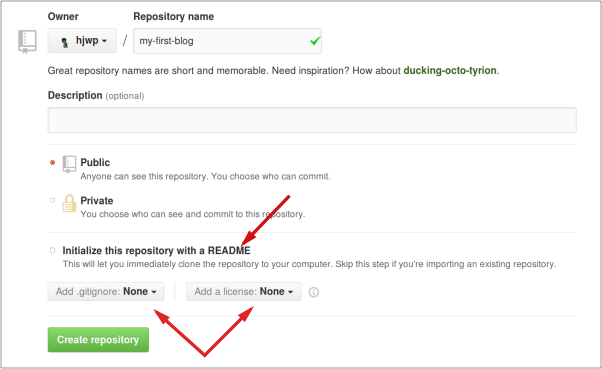

# W5 In Gruppen arbeiten mit Git

## Veröffentlichen!

Bis jetzt war deine Webseite nur auf deinem Computer verfügbar. Jetzt wirst du lernen wie du sie teilst. Dafür verwenden wir einen externen Dienst: [GitHub](https://www.github.com). Github ist ein "Code Hosting"-Dienst. Es gibt noch andere solcher Dienste, aber die meisten Programmierer haben heute ein Konto bei GitHub. Deshalb verwenden wir es auch.

Nach Einrichtung von Git werden zwei Orte für dich wichtig sein. Die Entwicklung und das Testen wirst du auf deinem lokalen Rechner durchführen. Wenn du mit deinen Änderungen zufrieden bist, wirst du eine Kopie deines Programms auf GitHub veröffentlichen.

## Git

> **Hinweis:** Falls du die Installationsschritte bereits durchgeführt hast, kannst du mit dem nächsten Abschnitt fortfahren und anfangen, dein Git-Repository zu erstellen.

### Unser Git-Repository

Git verwaltet die Veränderungen an einer Sammlung von Dateien in einem sogenannten Repository \(oder kurz "Repo"\). Legen wir eines für unser Projekt an. Öffne deine Konsole und gibt folgende Kommandos im `djangogirls`-Verzeichnis ein:

> **Hinweis:** Überprüfe dein aktuelles Arbeitsverzeichnis mit dem Befehl `pwd` \(OSX/Linux\) oder `cd` \(Windows\) bevor du das Repository initialisierst. Du musst dich im `djangogirls`-Verzeichnis befinden, bevor du fortfährst.

```text
$ git init
Initialized empty Git repository in ~/djangogirls/.git/
$ git config --global user.name "Dein Name"
$ git config --global user.email du@example.com
```

Die Initialisierung des Git-Repositorys müssen wir für jedes Projekt nur einmal machen \(danach musst Du Benutzernamen und Mail-Adresse nie wieder eingeben\).

Git wird die Änderungen an all den Dateien und Ordnern in diesem Verzeichnis aufzeichnen. Wir wollen aber, dass einige Dateien ignoriert werden. Dazu legen wir eine Datei `.gitignore` im Hauptordner \(`djangogirls`\) des Repos an. Öffne deinen Editor und erstelle eine neue Datei mit dem folgenden Inhalt:

```text
*.pyc
*~
__pycache__
myvenv
db.sqlite3
/static
.DS_Store
```

Speichere die Datei mit dem Namen `.gitignore` im "djangogirls"-Root-Verzeichnis.

> **Hinweis:** Der Punkt vor dem Dateinamen ist wichtig! Wenn du Schwierigkeiten beim Erstellen hast \(z.B. lassen Macs im Finder keine Dateien mit Punkt am Anfang erzeugen, Punkt-Dateien sind auf Linux und OS X "versteckte Dateien"\), dann verwende die "Speichern unter"-Funktion im Editor, das sollte immer funktionieren. Wichtig ist, dass du den Dateinamen nicht mit `.txt`, `.py` oder einer anderen Dateinamen-Erweiterung ergänzt -- die Datei wird von Git nur erkannt, wenn ihr Name exakt nur `.gitignore` ist.
>
> **Hinweis:** Eine der Dateien, die du in deiner `.gitignore`-Datei defniniert hast, ist `db.sqlite3`. Diese Datei ist deine lokale Datenbank, in welcher alle deine Benutzer und Posts gespeichert werden. Wir werden die gängige Web-Entwicklungs-Praxis befolgen, was heißt, dass wir separate Datenbanken für unsere lokale Test-Website und unsere öffentliche Website auf PythonAnywhere verwenden werden. Die Datenbank für letztere könnte SQLite sein, wie auf deiner Entwicklungsmaschine, aber normalerweise wirst du eine sogenannte MySQL-Datenbank nutzen, welche mit viel mehr Besuchern umgehen kann als SQLite. So oder so, dadurch, dass du deine SQLite-Datenbank für die GitHub-Kopie nicht verwendest, werden alle deine bisherigen Posts der Superuser nur lokal zur Verfügung stehen und du musst in der produktiven Umgebung neue hinzufügen. Betrachte deine lokale Datenbank als tollen Spielplatz, auf welchem du verschiedene Dinge ausprobieren kannst, ohne Angst zu haben, dass du deine wirklichen Post auf deinem Blog löschst.

Es ist hilfreich den Befehl `git status` vor `git add` auszuführen oder immer dann, wenn du dir unsicher bist, was geändert wurde. Das schützt vor manchen Überraschungen, wie z. B. das falsche Hinzufügen oder Übertragen von Dateien. Das `git status`-Kommando gibt Informationen über unbeobachtete/veränderte/hinzugefügte Dateien, den Status der Verzweigung und einiges mehr wieder. Deine Ausgabe sollte dem hier ähneln:

```text
$ git status
On branch master

Initial commit

Untracked files:
  (use "git add <file>..." to include in what will be committed)

        .gitignore
        blog/
        manage.py
        mysite/
        requirements.txt

nothing added to commit but untracked files present (use "git add" to track)
```

Nun speichern wir unsere Änderungen durch folgende Eingabe in der Konsole:

```text
$ git add --all .
$ git commit -m "My Django Girls app, first commit"
 [...]
 13 files changed, 200 insertions(+)
 create mode 100644 .gitignore
 [...]
 create mode 100644 mysite/wsgi.py
```

### Den Code auf GitHub veröffentlichen

Gehe auf [GitHub.com](https://www.github.com) eröffne ein neues, kostenloses Nutzerkonto. \(Falls Du es bereits während der Workshop-Vorbereitung eingerichtet hast, ist das großartig!\) Stelle sicher, dass Du Dein Passwort nicht vergisst \(füge es zu zu Deinem Passwort-Manager hinzu, falls Du einen solchen verwendest\).

Erstelle dann ein neues Repository und gib ihm den Namen "my-first-blog". Lass das Kontrollkästchen "initialise with a README" deaktiviert und die Einstellung der Option .gitignore leer \(das haben wir schon von Hand gemacht\) und lass die Lizenz auf "None".



> **Achtung:** Der Name `my-first-blog` ist wichtig -- du kannst auch einen anderen wählen, aber er wird im Folgenden noch sehr oft vorkommen und du wirst immer daran denken müssen, ihn in den Anweisungen entsprechend anzupassen. Es ist wahrscheinlich einfacher, bei `my-first-blog` zu bleiben.

In der nächsten Ansicht wirst du die clone-URL deines Repositorys sehen, die du in manchen der folgenden Kommandozeilenbefehlen verwenden wirst:


Nun müssen wir das Git-Repository auf deinem Computer mit dem auf GitHub verbinden.

Gib das Folgende auf der Kommandozeile ein \(ersetzte `<your-github-username>` mit dem Benutzernamen, den du beim Erstellen deines GitHub-Accounts gewählt hast, aber ohne die spitzen Klammern -- die URL sollte der clone-URL entsprechen, die du vorhin gerade gesehen hast\):

```text
$ git remote add origin https://github.com/<your-github-username>/my-first-blog.git
$ git push -u origin master
```

Wenn du zu GitHub pushst, wirst du nach deinem Benutzernamen und Passwort gefragt \(entweder direkt im Kommandozeilen-Fenster oder in einem Pop-Up-Fenster\), und nach der Eingabe deiner Zugangsdaten solltest du etwas Ähnliches wie das hier sehen:

```text
Counting objects: 6, done.
Writing objects: 100% (6/6), 200 bytes | 0 bytes/s, done.
Total 3 (delta 0), reused 0 (delta 0)
To https://github.com/ola/my-first-blog.git

 * [new branch]      master -> master
Branch master set up to track remote branch master from origin.
```

Dein Code ist jetzt auf GitHub. Schau gleich mal nach! Dort ist dein Code in guter Gesellschaft - [Django](https://github.com/django/django), das [Django Girls Tutorial](https://github.com/DjangoGirls/tutorial) und viele andere großartige Open Source Software-Projekte haben ihren Code auf GitHub. :\)

